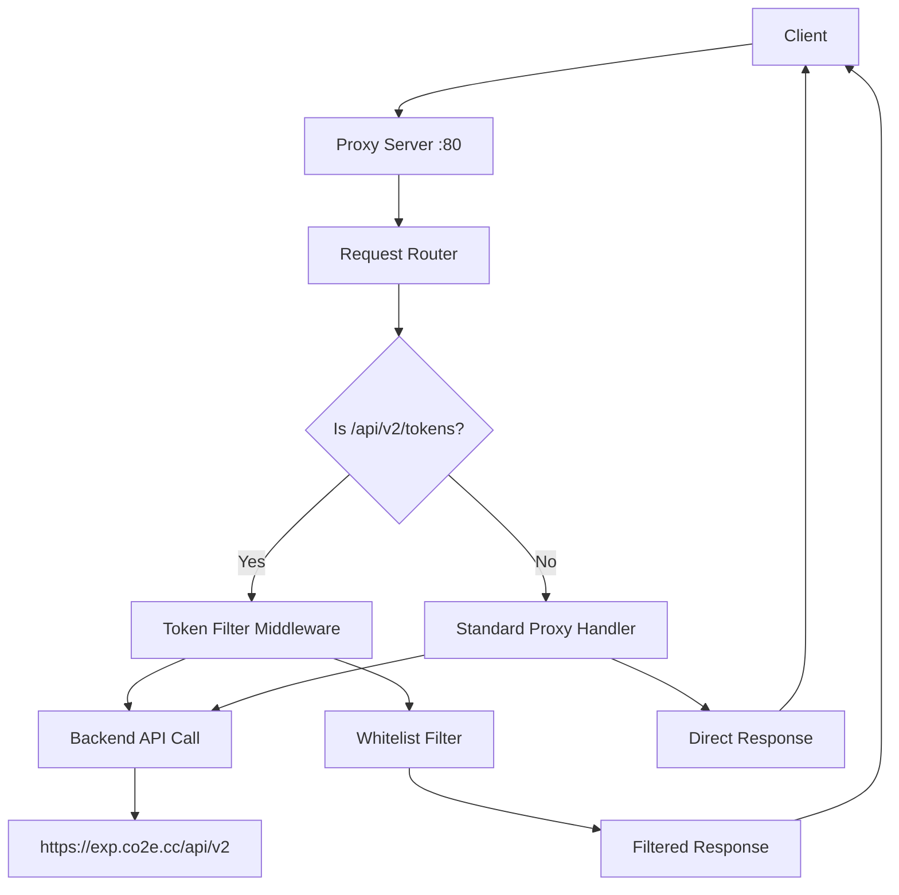

# Design Document

## Overview

The Go API Proxy is a lightweight HTTP reverse proxy server that forwards requests to a configurable backend API while providing special filtering capabilities for token endpoints. The application uses Go's standard library for HTTP handling and implements a middleware-based architecture for request processing.

## Architecture



The architecture follows a simple middleware pattern where:
- All requests first hit the main router
- Token requests are processed through the filtering middleware
- Other requests are proxied directly
- Configuration is loaded from environment variables
- Whitelist is loaded from a JSON file

## Components and Interfaces

### Main Server Component
```go
type ProxyServer struct {
    backendHost string
    client      *http.Client
    whitelist   *TokenWhitelist
}
```

### Token Whitelist Component
```go
type TokenWhitelist struct {
    Addresses []string `json:"addresses"`
    mu        sync.RWMutex
}

type TokenResponse struct {
    Items []Token `json:"items"`
}

type Token struct {
    Address     string `json:"address"`
    AddressHash string `json:"address_hash"`
    // ... other fields as per API response
}
```

### Configuration Component
```go
type Config struct {
    BackendHost string
    Port        string
    WhitelistFile string
}
```

## Data Models

### Token Structure
Based on the provided API response format:
```go
type Token struct {
    Address              string  `json:"address"`
    AddressHash          string  `json:"address_hash"`
    CirculatingMarketCap *string `json:"circulating_market_cap"`
    Decimals             string  `json:"decimals"`
    ExchangeRate         *string `json:"exchange_rate"`
    Holders              string  `json:"holders"`
    HoldersCount         string  `json:"holders_count"`
    IconURL              *string `json:"icon_url"`
    Name                 string  `json:"name"`
    Symbol               string  `json:"symbol"`
    TotalSupply          string  `json:"total_supply"`
    Type                 string  `json:"type"`
    Volume24h            *string `json:"volume_24h"`
}
```

### Whitelist Structure
```json
{
  "addresses": [
    "0x5db2B3f16E1a28ad4fe1229a2dc01f264a3f0614",
    "0x7254B7303A9d5d0A2F232eB62B0B27a06E068Ac7"
  ]
}
```

## Error Handling

### Error Types
1. **Backend Unreachable**: Return HTTP 502 Bad Gateway
2. **Invalid JSON from Backend**: Return HTTP 502 Bad Gateway  
3. **Whitelist File Missing**: Log warning, continue with no filtering
4. **Invalid Whitelist Format**: Log error, continue with no filtering
5. **Environment Variable Missing**: Use default values

### Error Response Format
```go
type ErrorResponse struct {
    Error   string `json:"error"`
    Message string `json:"message"`
}
```

### Logging Strategy
- Use Go's standard `log` package with structured logging
- Log levels: INFO, WARN, ERROR
- Include request IDs for tracing
- Log all backend communication errors
- Log whitelist loading issues

## Testing Strategy

### Unit Tests
1. **Token Filtering Logic**
   - Test whitelist matching
   - Test empty whitelist handling
   - Test malformed token data

2. **Configuration Loading**
   - Test environment variable parsing
   - Test default value handling
   - Test invalid configuration handling

3. **HTTP Handler Logic**
   - Test request routing
   - Test header forwarding
   - Test response transformation

### Integration Tests
1. **End-to-End Proxy Behavior**
   - Test complete request/response cycle
   - Test with real backend API (using test doubles)
   - Test error scenarios

2. **Whitelist File Operations**
   - Test file loading and reloading
   - Test file permission issues
   - Test concurrent access

### Performance Considerations
- Use connection pooling for backend requests
- Implement request timeout handling
- Consider caching for whitelist data
- Use efficient JSON parsing for large token lists

## Security Considerations
- Validate all input from clients
- Sanitize headers before forwarding
- Implement rate limiting if needed
- Secure whitelist file permissions
- Log security-relevant events

## Deployment Configuration
- Environment variables for configuration
- Docker container support
- Health check endpoint
- Graceful shutdown handling